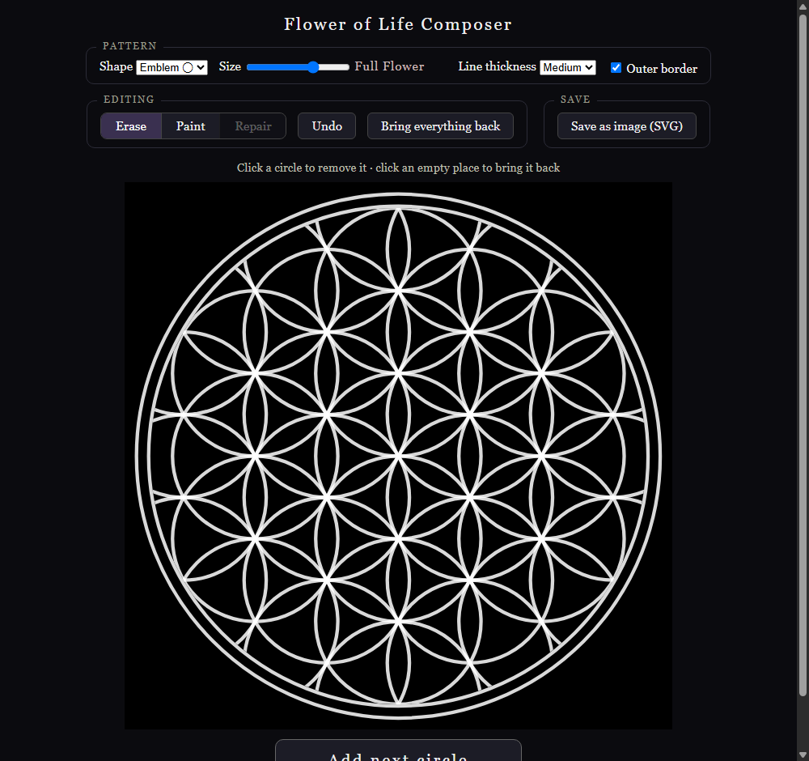

# Flower of Life Composer

An open workshop for living geometry. One HTML file, no dependencies, no build step. Open it and the flower of life is already there — whole, editable, yours.

**[Try it live](https://drthomasager.github.io/flower-of-life-composer/)**

## What it does

- **Grow the classical construction one circle at a time** — One Circle, Vesica Piscis, three through six placed around the center, Seed of Life, Flower of Life, Full Flower, out to seven rings. The big button (or the arrow keys) walks it; each new circle emerges from behind the existing pattern, animated, so the form unfolds out of itself
- **Two shapes** — the bounded Emblem, or the Tiling: a zoomable square window cut from the endless pattern
- **Three ways of editing** — Erase (click a circle to remove it), Paint (start from emptiness, click circles into presence), Repair (all absences shown faintly, click to bring them back) — with a sentence on screen always saying what a click does right now, plus Undo and Ctrl+Z
- **Line thickness** — thin, medium, or bold, visually consistent at every scale
- **Export clean geometry** — download your composition as SVG: white lines on transparent, dark lines on transparent, or white on black ground, with a filename that describes what it is. Exports are still geometry; the animation lives only in the composing

URL options: `?still` disables animation, `?frame=square` opens in the Tiling shape, `?growth=N` opens at stage N.

Every export is pure vector construction — circles on a hexagonal lattice, clipped by a boundary, enclosed in a double ring. Crisp at any size, from favicon to building facade.

## Why

It began with a screenshot — a photographed flower of life, blurred and compressed. But the flower of life is not an image; it is a construction. Nineteen circles on a hexagonal grid, arcs completing themselves to a boundary. You do not restore a photograph of mathematics. You draw the mathematics again, and it arrives perfect, because it was never anywhere else.

The flower of life belongs to an ancient family — the seed of life, the fruit of life, Metatron's cube, the vesica piscis, girih tilings, rose windows, kolam, mandalas. Every one of them is constructive geometry: circles, lines, and ratios in conversation. The dream of this project is to become the open workshop for that whole family — a place where the world's sacred and constructive patterns live as editable mathematics rather than as flattened images passed around and degraded.

One commitment underneath everything: **every pattern remains construction, never image.** Anyone can open the file and see how the form arises. The knowledge stays transmissible. That is what the tradition always was — geometry as a teaching that survives because each generation can re-derive it.

## Running locally

Download `index.html` and open it in a browser. That's the whole installation.

## Contributing

The entire app is one readable file structured in three regions — **model** (pure state), **render** (the living view: ghosts, hover), **serialize** (deterministic SVG export). See [CONTRIBUTING.md](CONTRIBUTING.md) — there is a door for pattern makers, coders, geometers, historians, and makers with real machines.

## License

Code is [MIT](LICENSE). Compositions you export are yours entirely — use them for anything, no attribution needed. The flower of life has been drawn on temple walls in Abydos, in Leonardo's notebooks, on the thresholds of homes. It has never belonged to anyone. A tool for drawing it shouldn't either.
